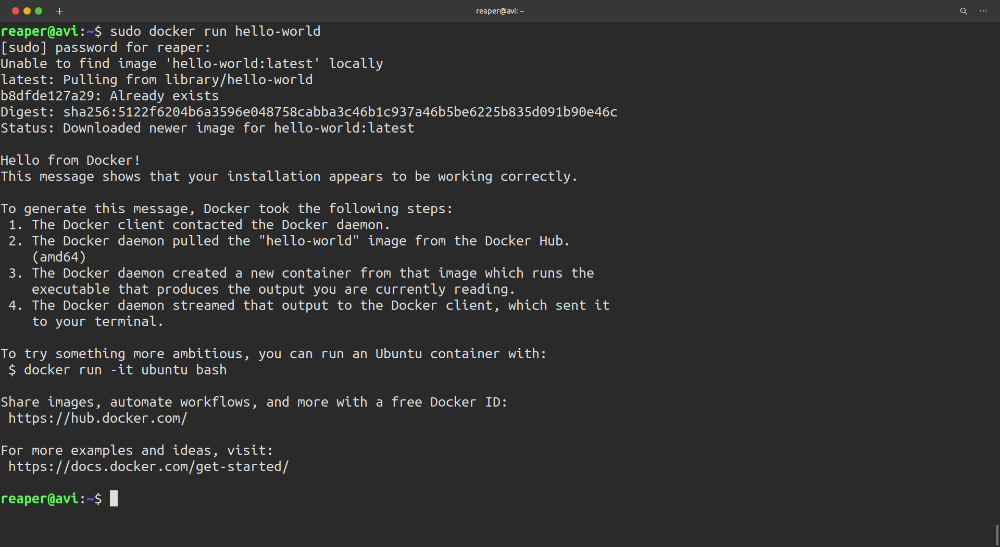

## Docker :

- Docker is a platform for building, running and shipping out applications.

| Container                                          | Virtual Machine                                  |
| -------------------------------------------------- | ------------------------------------------------ |
| An isolated environment for running an application | An abstraction of a machine. (Physical hardware) |
| Need less hardware resources                       | Each VM needs a full-blown OS                    |
| Start quickly                                      | Slow to start                                    |
| Allow running multiple apps in isolation           | \*                                               |
| Use OS of the host                                 | Resource intensive                               |

## Installing Docker container: Linux (Ubuntu 20.04 LTS)

- Updating the Ubuntu package database.

```bash
    $ sudo apt-get update
```

- For silent installation

```bash
    $ sudo apt install docker.io -y
```

- Now that Docker is installed and running you should verify that everything is working okay. This can be done using the hello-world app. From the command line run :

```bash
    $ sudo docker run hello-world
```



- You can also check your docker version by using following commands:

```bash
    $ docker version
```

```Output
    Client:
        Version:           20.10.2
        API version:       1.41
        Go version:        go1.13.8
        Git commit:        20.10.2-0ubuntu1~20.04.2
        Built:             Tue Mar 30 21:24:57 2021
        OS/Arch:           linux/amd64
        Context:           default
        Experimental:      true

    Server:
        Engine:
        Version:          20.10.2
        API version:      1.41 (minimum version 1.12)
        Go version:       go1.13.8
        Git commit:       20.10.2-0ubuntu1~20.04.2
        Built:            Mon Mar 29 19:10:09 2021
        OS/Arch:          linux/amd64
        Experimental:     false
        containerd:
        Version:          1.3.3-0ubuntu2.3
        GitCommit:
        runc:
        Version:          spec: 1.0.2-dev
        GitCommit:
        docker-init:
        Version:          0.19.0
        GitCommit:
```

## Making Docker start automatically on system boot:

```bash
    $ sudo systemctl enable --now docker
```

## Building a Docker container:

```bash
    $ docker build -t <REPOSITORY-NAME> <directory>
```

- For Instance

```bash
    $ docker build -t hello-docker .
```

- Period(.) stands for whole directory of the root project.


## For checking list of repositories:

```bash
    $ docker images
```

## Running a Docker container:

```bash
    $ docker run <REPOSITORY-NAME>
```


## Deleting a Docker container:

```bash
    $ docker rmi -f <IMAGE-ID>
```

## Getting an Ubuntu terminal in Docker container:

```bash
    $ docker run it ubuntu
```
