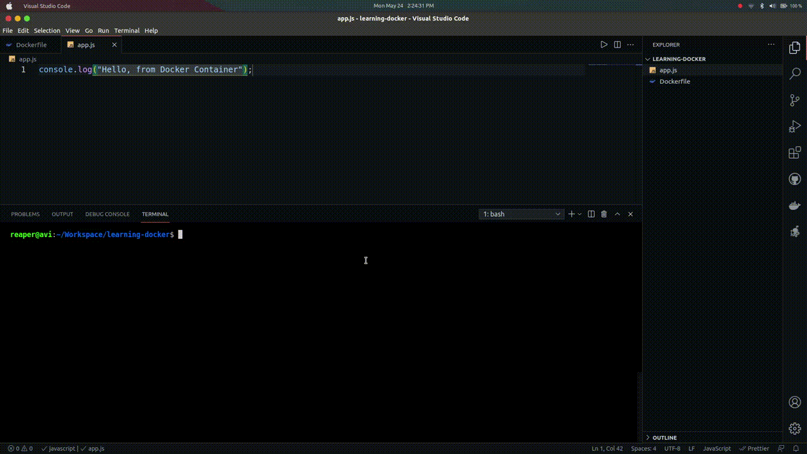
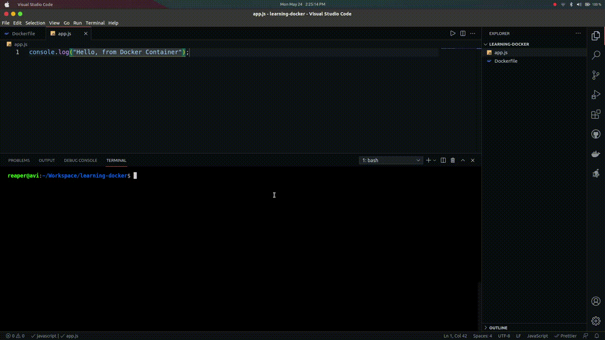

## Docker:

- Docker is a platform for building, running and shipping out applications.

## Building a Docker container:

```bash
    $ docker build -t <REPOSITORY-NAME> <directory>
```

- For Instance

```bash
    $ docker build -t hello-docker .
```

- Period(.) stands for whole directory of the root project.



## Running a Docker container:

```bash
    $ docker run <REPOSITORY-NAME>
```



## Deleting a Docker container:

```bash
    docker rmi -f <IMAGE-ID>
```
